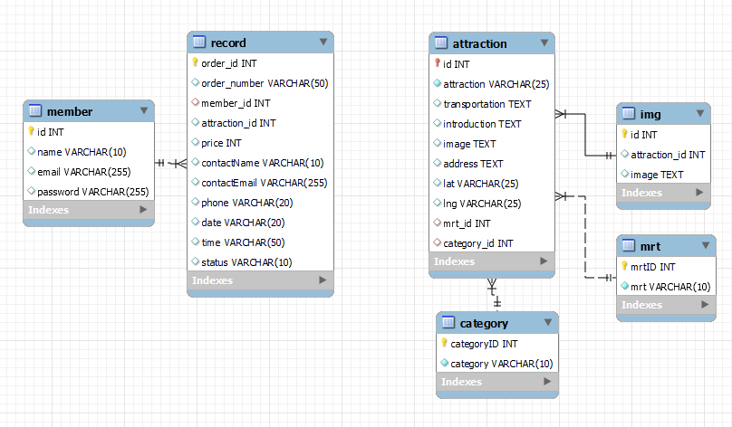
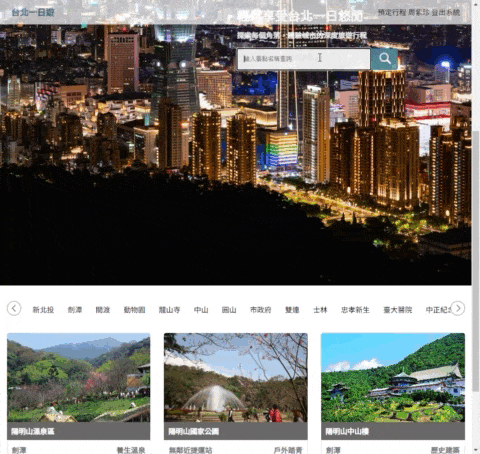
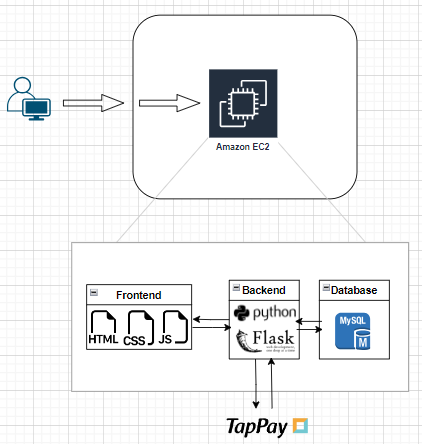

# Taipei Day Trip
website URL : http://52.198.121.57:3000

# About this project
This website is built upon a frontend-backend separated architecture. Moreover, it follows RESTful API design principles and seamlessly integrates financial services.

### Upon load in this page
I employ CSS animations to generate dynamic effects for the HTML elements on the index page.

.gif>)

Also, I have implemented lazy loading to optimize the loading of data on the website.

Responsive web design (readme_pictures/RWD) ensures that this website adapts seamlessly to various screen sizes and monitors.

.gif>)

### Search attraction

Designing the database structure in accordance with the principles of database normalization.
Additionally, establishing indexes on these tables enhances search efficiency.

### Carousel images

### Order trip

I utilize Tappay as my Third-party financial transactions. As user paying successfully, web page will lead to the order success and history page.

# Project Struct

### Explanation about the user route
- The user's request goes through VPC, and enters the EC2 instance, which serves as the virtual server hosting the website. The EC2 instance is responsible for handling user requests and interacting with other services.
- 