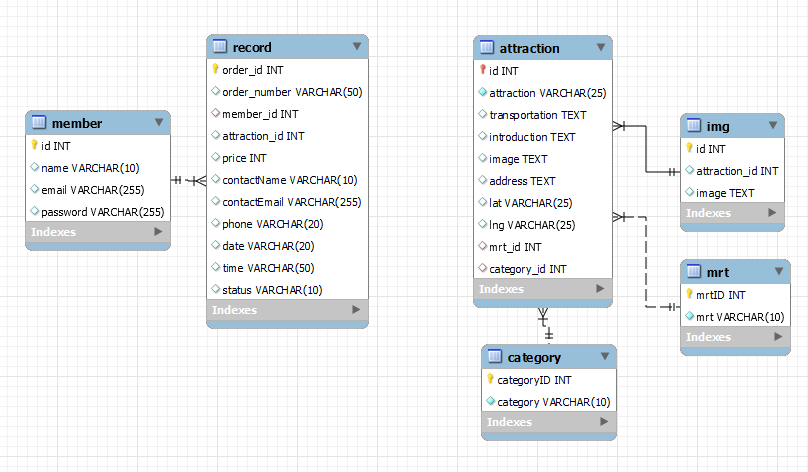

# Taipei Day Trip
website URL : http://52.198.121.57:3000

# About this project
This website is built upon a frontend-backend separated architecture. Moreover, it follows RESTful API design principles and seamlessly integrates financial services.

### Upon load in this page
I employ CSS animations to generate dynamic effects for the HTML elements on the index page.

.gif>)

Also, I have implemented lazy loading to optimize the loading of data on the website.

Responsive web design (RWD) ensures that this website adapts seamlessly to various screen sizes and monitors.

.gif>)

### Search attraction

Designing the database structure in accordance with the principles of database normalization.
Additionally, establishing indexes on these tables enhances search efficiency.

### Carousel images

### Order trip

